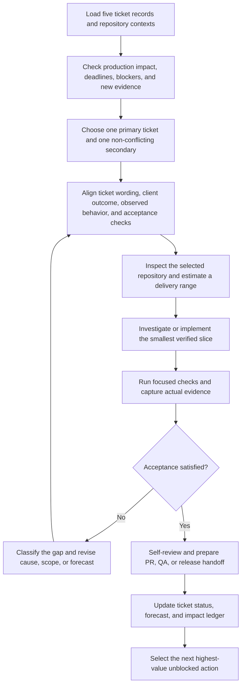

# Five-ticket Senior Software Engineer system

This operating system supports five tickets across different repositories, production investigation, and coordination with QA, product, and DevOps. It optimizes for verified delivery, controlled context switching, and evidence of impact.

## Daily flow



## Two automation outcomes

### Faster completion

- Reuse a verified context record for each repository.
- Analyze ticket wording against the client's actual concern before coding.
- Batch inspection of callers, implementation, tests, and configuration.
- Keep one primary implementation ticket to reduce repository switching.
- Use production waiting time for an independent secondary ticket.
- Generate PR, QA, DevOps, and status drafts from actual evidence.
- Update deadlines when new evidence changes the work.

### Stronger performance evidence

- Record customer outcome and measurable result for every delivered ticket.
- Capture production recovery, quality improvements, risks raised early, mentoring, and cross-team coordination.
- Generate weekly and review-period summaries from evidence instead of memory.
- Map achievements to the new company's documented level expectations when provided.

This evidence can support a compensation discussion. Salary decisions remain dependent on company policy, role calibration, market conditions, budget, and manager assessment.

## Start each day

```text
Use $senior-developer in multi-ticket mode.
Update today's five-ticket cockpit from the repository and ticket evidence I provide.
Recommend one primary ticket and one independent secondary ticket.
For the primary ticket, align the client outcome, ticket wording, observed behavior,
acceptance checks, estimate range, and next evidence-producing action.
Do not send messages, merge, deploy, or change production unless I explicitly authorize it.
```

## Close each day

```text
Use $senior-developer to close today's cockpit from actual work evidence.
Separate locally verified, ready for review, released, and production-verified items.
Draft concise updates for product, QA, and DevOps where relevant.
Update the impact ledger with measurable results and evidence links only.
```

Templates:

- [Daily ticket cockpit](../reusable-skills/senior-developer/assets/daily-ticket-cockpit.md)
- [Engineering impact ledger](../reusable-skills/senior-developer/assets/impact-ledger.md)
