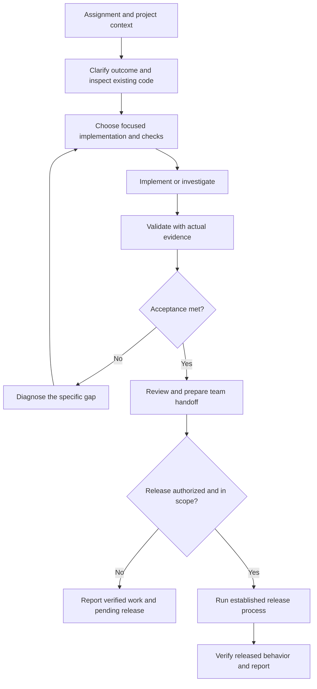

# Reusable senior software developer workflow

This workflow supports your new role across projects. It is a reusable Codex skill, not a scheduled bot or a production integration. The existing principal architect workflow and CartSvc repository remain separate.

## Start work

Open the target repository in a new Codex task and invoke the skill with the assignment:

```text
Use $senior-developer for this project.
Repository: /path/to/my-project
Task: implement the assigned feature from the supplied requirements.
Acceptance criteria: [observable results].
Follow this repository's conventions and report actual validation evidence.
```

Use the project context template in the skill's `assets/project-context.md` when onboarding to a repository. Codex should fill discoverable facts from the project, not ask you to manually supply every command. Your new company's standards need to come from you or authorized project documentation.

## Repeatable assignments

| Work | Example instruction |
| --- | --- |
| Full-stack feature | Use $senior-developer to implement this ticket across the necessary UI and API layers, validate acceptance, and prepare a review description. |
| Bug fix | Use $senior-developer to reproduce this error, find the cause, implement a focused fix, and provide regression evidence. |
| Code review | Use $senior-developer to review this diff. Prioritize actionable defects and cite the relevant lines. |
| Performance | Use $senior-developer to investigate this slow path, establish a baseline, and measure any improvement under comparable conditions. |
| Release preparation | Use $senior-developer to prepare release and rollback steps for this revision and environment. |
| Production incident | Use $senior-developer to investigate these incident symptoms using the authorized diagnostics and prepare the next safe action. |
| QA handoff | Use $senior-developer to draft QA scenarios from the implemented acceptance criteria and actual test results. |
| Estimate | Use $senior-developer to inspect this assignment and propose an effort range with assumptions and dependencies. |
| Team update | Use $senior-developer to draft a status update from the current diff, completed checks, and blockers. |
| Mentoring | Use $senior-developer to explain this error to a junior developer with a focused example and a verification step. |

## Work loop



The skill can perform authorized local work and prepare communication or release artifacts. Sending team messages, merging, and changing production require the corresponding task authorization. It will not claim a deployment or production validation without evidence.

The skill's structure can be validated automatically. Its effectiveness on your new stack must be assessed using real assignments; no time saving or company-specific compliance is claimed in advance.
